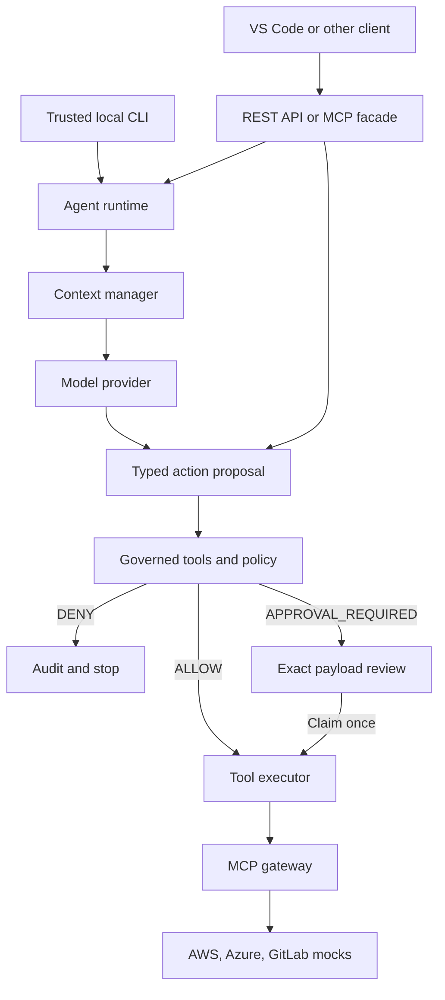
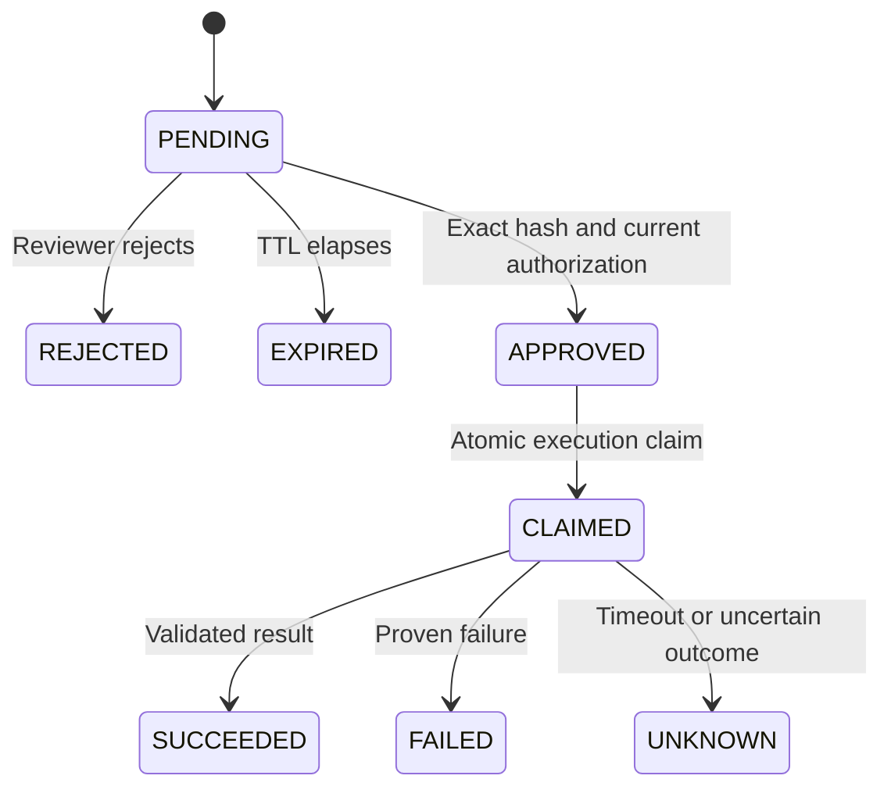
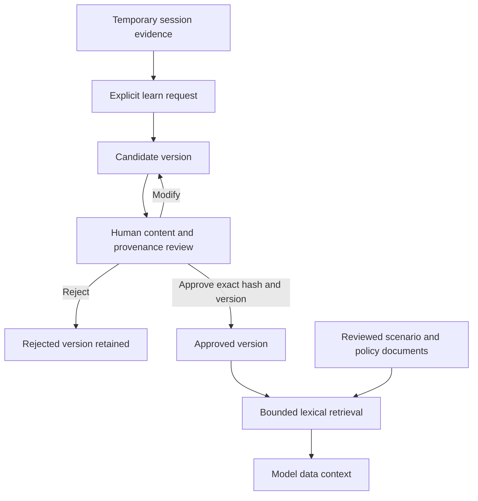

# Architecture and extension guide

The harness owns orchestration and authorization. A model returns text or a typed tool proposal; only `GovernedTools` can turn a proposal into an execution. API handlers and CLI commands compose services without implementing policy decisions.

## Request path

An external AI client can call `propose_action` directly. That bypasses the internal mock model, **not** the policy, approval, validation, audit, or execution services. The runtime has an explicit step budget and context budget. The only bundled model is deterministic and exists to make the demo and regressions reproducible.

## Module boundaries

| Module | Responsibility | Must not do |
| --- | --- | --- |
| `agents` | Validate declarative identity, versions, permissions, source allowlists | Execute tools |
| `skills` | Discover, load, validate versioned instructions and dependencies | Grant capabilities through instructions |
| `context` | Select reviewed documents and bound model context | Treat retrieved text as authority |
| `models` | Provider-neutral generation protocol and mock adapter | Hold infrastructure credentials |
| `runtime` | Bounded orchestration and the governed tool entry point | Delegate authorization to a model |
| `policies` | Deterministic YAML policy and trusted environment resolution | Accept model-provided risk or environment labels |
| `approvals` | Store, hash, expire, reject, and atomically claim actions | Rewrite the approved payload |
| `tools` | Registry, schema validation, execution limits, transport | Learn risk classifications from remote metadata |
| `memory` | User/agent/session scoped temporary state | Promote conversation into trusted knowledge |
| `learning` | Produce candidate documents with session evidence | Approve its own output |
| `knowledge` | Immutable versions, review, provenance, lexical retrieval | Replace an existing revision from a changed file |
| `audit` | Append-only structured events and hash-chain verification | Store arbitrary prompt or tool-response bodies |
| `observability` | Traces, counters, latency instruments, exporter boundary | Emit secrets or raw provider errors |
| `api` | Authentication, schema handling, transport adapters | Own business logic |
| `evals` | Repeatable behavior and security expectations | Claim model quality from mock behavior alone |

`runtime/container.py` is the composition root. It accepts injected model, gateway, and telemetry adapters. SQLAlchemy manages persistence; SQLite is the exercised local backend. PostgreSQL is an architectural extension point, not a certified drop-in deployment: add migrations and test locking, transaction isolation, audit-chain serialization, and concurrent approval claims first.

## Tool trust and MCP

The trusted registry defines name, provider, semantic version, risk, resource fields, and input/output JSON schemas. Both sides of every tool call are validated. Remote MCP discovery is useful for inspection but does not replace these definitions. Risk changes require an operator-reviewed registry change.

There are two independent MCP roles:

1. **Provider transport:** `StdioMCPGateway` launches the repository's AWS, Azure, and GitLab mock servers with the official MCP Python SDK. An absolute executable path and fixed argument list come from trusted configuration. Provider subprocesses do not inherit arbitrary harness or cloud-token environment variables.
2. **AI-facing facade:** `harness mcp` is a stdio MCP server that calls the running REST API with an operator token. It exposes discovery, running, action proposals, and candidate learning. It has no approval, promotion, shell, or credential-retrieval tools.

`config/harness.yaml` selects `inprocess_mock` by default for fast local execution. Set `transport: stdio_mock` to exercise actual MCP subprocess transport. Both use the same schemas and persistent mock cloud state. MCP uses the supported v1 SDK range `mcp>=1.12,<2`; a major-version upgrade is a separate compatibility change. See the [official Python SDK](https://github.com/modelcontextprotocol/python-sdk).

## Authorization and approval state

Policy matching considers user, agent, full tool name, action suffix, resource identity, environment, and registry risk. Matching decisions combine in the order `DENY > APPROVAL_REQUIRED > ALLOW`. No match is a denial. Account, subscription, and project mappings in `policies/environments.yaml` determine environment; text returned by a resource cannot relabel production as development.

The initial agent grants read groups and explicitly enumerates tools it may **propose**. A proposal permission does not grant execution permission. The bundled configuration requires review for all writes and blocks destructive actions. High-risk writes always require approval. Low-risk writes can be explicitly enabled without review through both agent capabilities and policy; setting only a YAML ALLOW rule is insufficient.

`default_permissions.low_risk_write` accepts `allow`, `approval_required`, or `deny`, defaulting to `approval_required`. Automatic low-risk execution requires the tool's group in `agent.tool_groups`, `low_risk_write: allow`, and at least one matching YAML rule with no matching review or denial restriction. `proposal_tools` alone cannot grant it, and `write: deny` remains an overriding block. For example, a reviewed development-only issue workflow could receive `gitlab.write` and low-risk permission after an operator scopes its inventory and policy grants appropriately. The default read-only groups and production review rules remain unchanged.

`status` and `execution_status` are separate columns; approval and `CLAIMED` are committed atomically, so the diagram's approval/claim split is conceptual. Reviews are tied to the serialized action envelope, which includes arguments, agent/tool versions and digests, policy revision, resource identity, environment, risk, session, and requesting user. Review requires the displayed `payload_hash`. Current authorization is rechecked before claiming. Changed policy or definitions require a new proposal.

The mock security-group write also includes `expected_revision` so an old review cannot overwrite a changed resource. A claimed action cannot be replayed. Read operations have bounded transient transport retries; writes have none. A write timeout may mean the provider changed state before the connection failed. Such an action remains `UNKNOWN` and needs manual reconciliation. A process crash can leave a claim unresolved; there is no automatic recovery worker in this MVP.

Approved execution and directly allowed reads or opted-in low-risk writes recheck authorization before dispatch. This prevents a queued action from relying solely on the policy decision made before an execution slot became available.

## Knowledge, memory, and learning

Session data has an owner, agent, expiration, bounded history, and sanitized content. It does not become knowledge merely because the model repeated it. Learning records unverified excerpts from a session or an explicit proposed statement. Reviewers remain responsible for checking source evidence; a session reference is provenance, not proof of correctness.

Knowledge versions live authoritatively in SQL. Each creation, modification, rejection, or promotion appends a revision. Markdown files with YAML frontmatter are human-readable exports under `knowledge/<category>/<id>-v<version>.md`. Existing SQL versions cannot be silently replaced by editing exports. On startup, operator-provisioned files for a new identity may be imported only when strict metadata and review status agree with their folder. Therefore filesystem access to those directories is administrative access, not an untrusted upload channel.

Only reviewed records from `approved`, `scenarios`, and `policies` participate in normal retrieval. Pending edits do not displace the previously approved revision. The store offers explicit candidate inclusion for inspection; normal context building never enables it. Similarity is lexical term scoring with document-length normalization, not embedding retrieval or semantic understanding. The context manager records the IDs and versions actually included and drops excess documents before exceeding its character budget.

## Adding a provider or model

To add Wiz, Splunk, Kubernetes, GCP, or an internal API:

1. Register reviewed, versioned `ToolDefinition` objects with strict input/output schemas and trusted risk classes.
2. Implement the `MCPGateway` port or configure a reviewed MCP server transport. Acquire short-lived, scoped credentials in the adapter through a `SecretProvider`.
3. Add trusted scope-to-environment mappings and explicit policy rules.
4. Grant only needed read groups and proposal capabilities in an agent definition.
5. Add malformed-input, denial, approval, stale-resource, timeout, and response-injection tests before enabling writes.

To add a model, implement `ModelProvider.generate(messages, tools, response_schema)` and inject it at the composition root. Normalize provider responses to `ModelResponse`, validate tool calls, and report token usage. Provider credentials remain in the adapter, outside model-visible messages and tool parameters. No specific cloud SDK or LLM framework is required by the runtime.

## Implementation phases

The repository is organized around seven independently validated stages: foundations; typed mock/MCP tools; policy, approval, and audit; reviewed knowledge and memory; agent runtime and interfaces; OpenTelemetry; and evaluations. Phase commits preserve a runnable system as each layer is introduced. See the commit history for the implementation sequence and the README for the final verification commands.

OpenTelemetry emits console spans and sanitized structured INFO operation events to stderr. `HARNESS_TRACE_CONSOLE=false` disables the full spans while `config/logging.yaml` independently controls the structured events. Span exporters and metric readers are injected at the telemetry boundary; model or tool data does not select a logging destination.

## Production evolution

Replace bearer personas with OIDC identity and scoped RBAC/ABAC; deploy the reviewer interface in a separate trust domain. Move state to PostgreSQL with migrations and transactional locking tests. Use an outbox/job worker and provider reconciliation for approval execution, without assuming exactly-once cloud effects. Add distributed concurrency/rate limits, tenancy, encrypted state, retention workflows, and backup/restore tests.

Resolve resource ownership and environment from a trusted inventory or authenticated cloud control plane. Add workload identity and short-lived provider credentials, MCP network egress restrictions, server allowlists, artifact verification, and service isolation. Export audits to externally protected append-only storage, and export telemetry through an OpenTelemetry Collector to the chosen observability backend. These improvements preserve the same model, policy, governance, transport, and knowledge interfaces.
